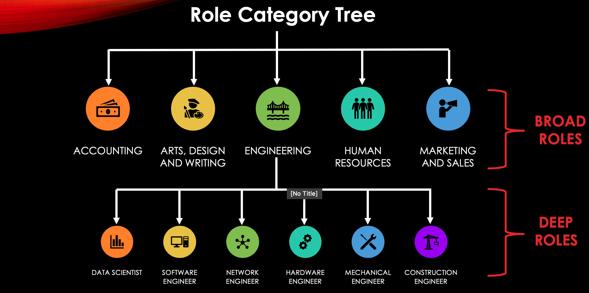

# Profile Fit Prediction 
        -With better PROfile FIT, comes better PROFIT

## MOTIVATION
Screening resumes plays a crucial part in hiring the right talent for an organization. However, this process is laborious and so the organizations use automatic screening systems for filtering resumes which are often inaccurate. 62% of recruiters admit that qualified candidates are overlooked by current resume screening systems
There are many limitations in the current systems:

1. Current systems are naïve because they look for the exact keyword from the job description in resumes for filtering candidates.
2. Current systems are ambiguous as they don't capture the context of keywords.
3. Candidates can easily trick the current systems by adding important keywords from job descriptions to their resumes.

After researching about these screening systems and talking to some recruiter, I came up with a pipeline and built a tool for recruiters to overcome the limitations of the existing resume screening systems.  

## Web App:
http://www.profilefitprediction.me:8000/

## Preparing an environment to run the code:

1. Install Anaconda or Miniconda Package Manager from [here](https://www.anaconda.com/products/individual)
2. Create a new virtual environment and install the required packages:
```bash
conda create -n profile_fit_prediction python
```
```bash
conda activate profile_fit_prediction
```
If using cuda:
```bash
conda install pytorch cudatoolkit=10.0 -c pytorch
```
3. clone the repository and change directory to downloaded repo

4. Install all requirements
```bash
pip install -r requirements.txt 
```

## Minimal Start:

1. Navigate to Source directory 
```bash
cd source
```

2. Download trained BERT model (~0.5 GB) 
```bash
https://drive.google.com/drive/folders/1M_LQEbf7POiRAibYDB25y1dNefcspH2C?usp=sharing
```

3. Run the Flask Server
```bash
python server.py
```

## From Scratch

1. Data Collection

Scraper to get candidates profile data from LinkedIn

(i) Notebook: LinkedIn_Data_Crawler.ipynb - Crawls user profile ids from different roles (example: Data Scientist, Artist and Accountant etc.)

(ii) Once I scraped profiles, I used https://github.com/jvandenaardweg/linkedin-profile-scraper to get skills and experience from each profile.

While crawling Data, I built role category tree



2. Data Modelling - Broad Role Classification

Notebook: Broad_Role_Classification_Using_Skills.ipynb

3. Data Modelling - Deep Role Classification

Notebook: Deep_Role_Classification_Using_Experience.ipynb

### Parameters

Here I am explaining all model parameters, you can find in `Deep_Role_Classification_Using_Experience.ipynb`

| Parameter name              | Default value        | Details                                                      |
| --------------------------- | -------------------- | ------------------------------------------------------------ |
| model_type                  | None                 | Type of models e.g. BERT, XLNET, Roberta                     |
| model_name                  | None                 | https://huggingface.co/transformers/pretrained_models.html   |
| args (optional)             | None                 | A dictionary containing any settings that should be overwritten from the default values. |
| use_cuda                    | True                 | Flag used to indicate whether CUDA should be used.           |
| num_labels                  | 2                    | Number of labels for classification                          | 
| weight                      | 1 (equal weights)    | Weights assigned for each label while calculating loss       |

### Model Args (args in parameters)

Here I am explaining all model args, you can find in `Deep_Role_Classification_Using_Experience.ipynb`

| Arg name                         | Default value        | Details                                                      |
| -------------------------------  | -------------------- | ------------------------------------------------------------ |
| output_dir (compulsory)          | "outputs/"           | Output is stored in this directory.                          |
| cache_dir (optional)             | "cache/"             | Cache files stored in this directory                         |
| best_model_dir (optional)        | "outputs/best_model/"| This is when eval during traing is true - store best model   |
| fp16                             | True                 | Needs to use NVidia Apex library. Helps inn reducing model size enables training with larger mini-batches  |
| max_seq_length                   | 128                  | Maximum limit of sequence (input) for the model              |
| train_batch_size                 | 8                    | Size of training batch                                       |
| eval_batch_size                  | 8                    | Size of evaluation batch                                     |
| gradient_accumulation_steps      | 1                    | Number of training steps before we call optimer.step()       | 
| num_train_epochs                 | 1                    | Number of epochs while training model                        |
| weight_decay                     | 0                    | this adds L2 penalty for regularization                      |
| learning_rate                    | 4e-5                 | Learning rate used while training using adam optimizer       |
| adam_epsilon                     | 1e-8                 | Adam optimizer hyperparameter epsilon value                  |
| max_grad_norm                    | 1.0                  | Max gradient clipping value to avoid exploding gradient ptoblem      |
| do_lower_case                    | False                | If you are are using unncased model - set it to True           |
| logging_steps                    | 50                   | https://huggingface.co/transformers/pretrained_models.html   |
| evaluate_during_training         | False                | If you want to find ideal hyperparameters - give True and add eval-df while training  |
| evaluate_during_training_steps   | 2000                 | Perform evaluation at every specified number of steps. A checkpoint model and the evaluation results will be saved.           |
| evaluate_during_training_verbose | False                | Give True if you eant to print more information              | 
| use_cached_eval_features         | False                | Give True if Evaluation during training need to use cache    |
| save_eval_checkpoints            | True                 | Save model checkpoints for evaluation performed              |
| save_steps                       | True                 | Save a model checkpoint at every specified number of steps   |
| no_cache                         | False                | Save cache features to disk                                  |
| save_model_every_epoch           | True                 | saves every model at the end of epoch if True                |
| tensorboard_dir                  | None                 | The default directory of tensorboard files is runs/Dec02_09-32-58_36d9e58955b0/              |
| overwrite_output_dir             | False                | If True, the trained model will be saved to the ouput_dir and will overwrite existing saved models in the same directory.   |
| reprocess_input_data             | True                 | If True, the input data will be reprocessed even if a cached file of the input data exists in the cache_dir.a                                |
| process_count                    | 1 or cpu_count() - 2 | if cpu_count() > 1 then process_count = cpu_count() - 2      |
| n_gpu                            | 1                    | Number of GPUs used for building the model                   | 
| use_multiprocessing              | True                 | use multiproccessing while converting data to features       | 
| wandb_project                    | None                 | name of project defined in weights and biases for visualizing training loss and evaluation loss              |
| wandb_kwargs                     | {}                   | if using weights and biases library, pass arguments          |
| use_early_stopping               | True                 | Use early stopping to stop training when early_stopping_metric doesn't improve (based on early_stopping_patience, and early_stopping_delta)|
| early_stopping_patience          | 3                    | Terminate training after this many evaluations without an improvement in eval_loss greater then early_stopping_delta      | 
| early_stopping_delta             | 0                    | The improvement over best_eval_loss necessary to count as a better checkpoint.    |
| early_stopping_metric            | eval_loss            | Metrics used for early stopping                              |
| early_stopping_metric_minimize   | True                 | Give True if early_stopping_metric need to be maximum        |
| manual_seed                      | None                 | Use this to manually set seed to reproduce results           |
| config                           | {}                   | Use this parameter to change the configuration options       |


### Training Args

Here I am explaining all training args, you can find in `Deep_Role_Classification_Using_Experience.ipynb`

| Arg name                    | Default value        | Details                                                      |
| --------------------------- | -------------------- | ------------------------------------------------------------ |
| train_df                    | None                 | Dataframe with 2 columns - text and labels                   |
| args (optional)             | None                 | Overwrite changes to the specific model only                 |
| eval_df (optional)          | None                 | Evaluation dataframe used when evaluate_during_training is True         |
| **kwargs (optional)         | None                 | Add extra evaluation metrics like f1=sklearn.metrics.        | 
| weight (optional)           | equal weights        | Weights assigned for each label while calculating loss       |
 
